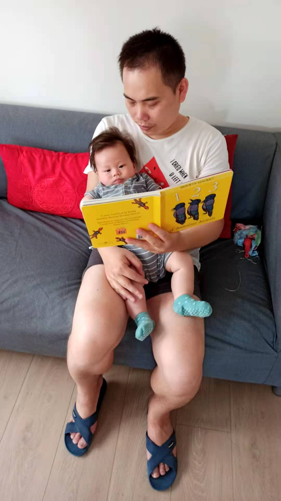
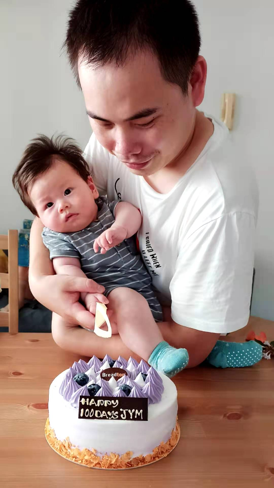
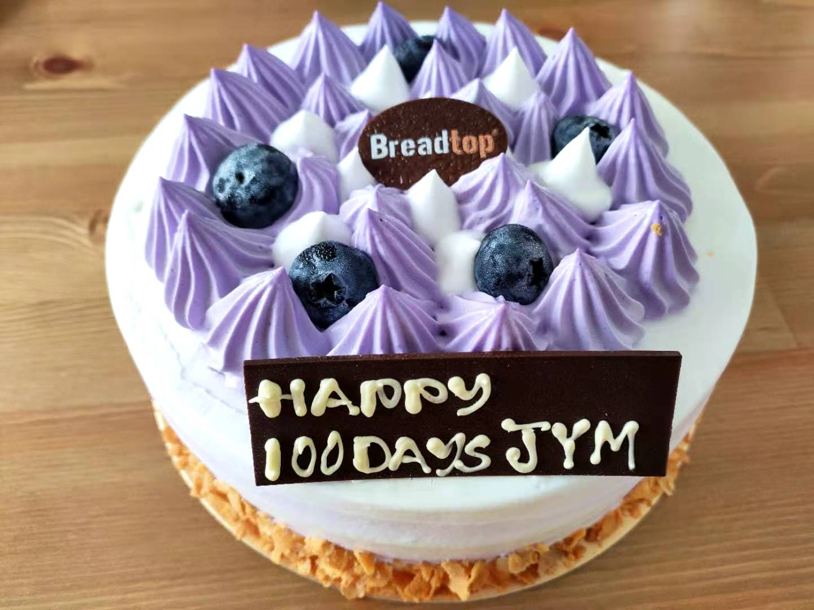
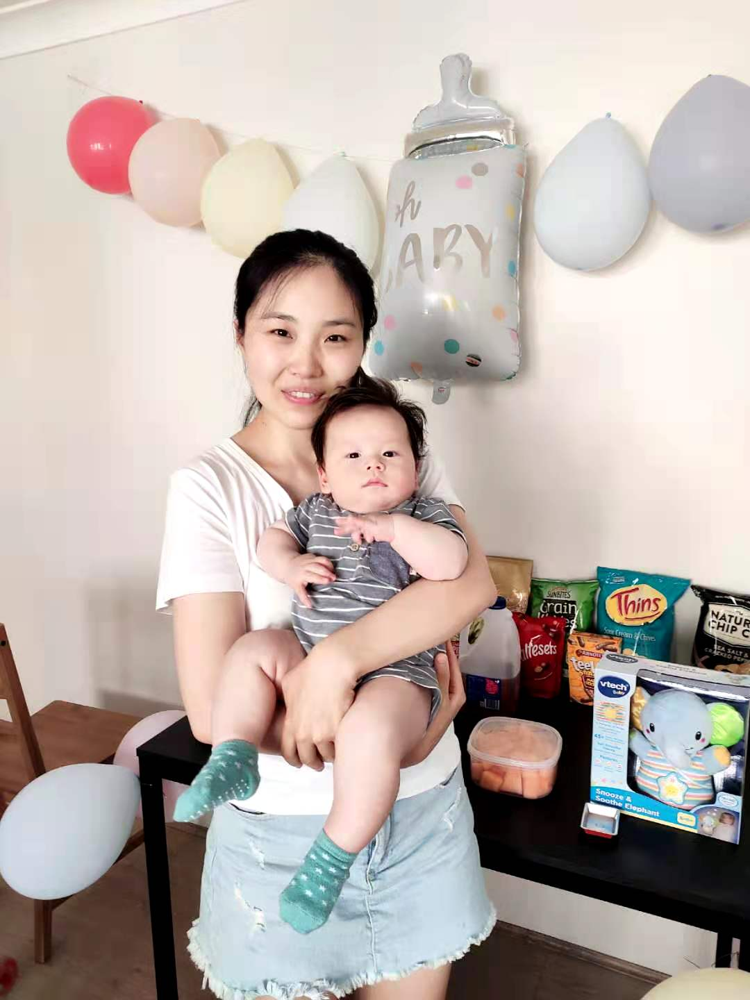
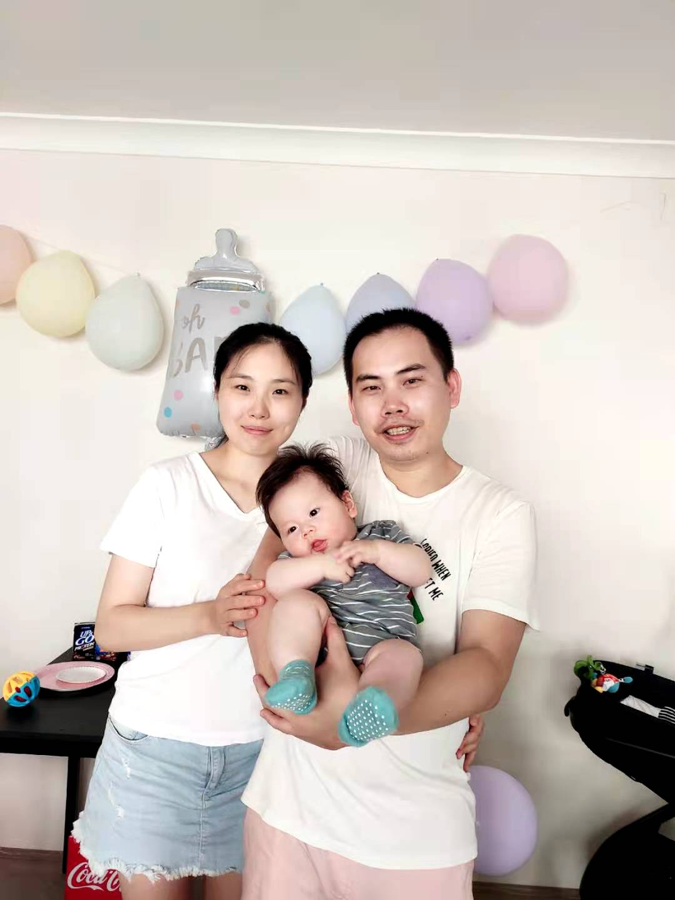
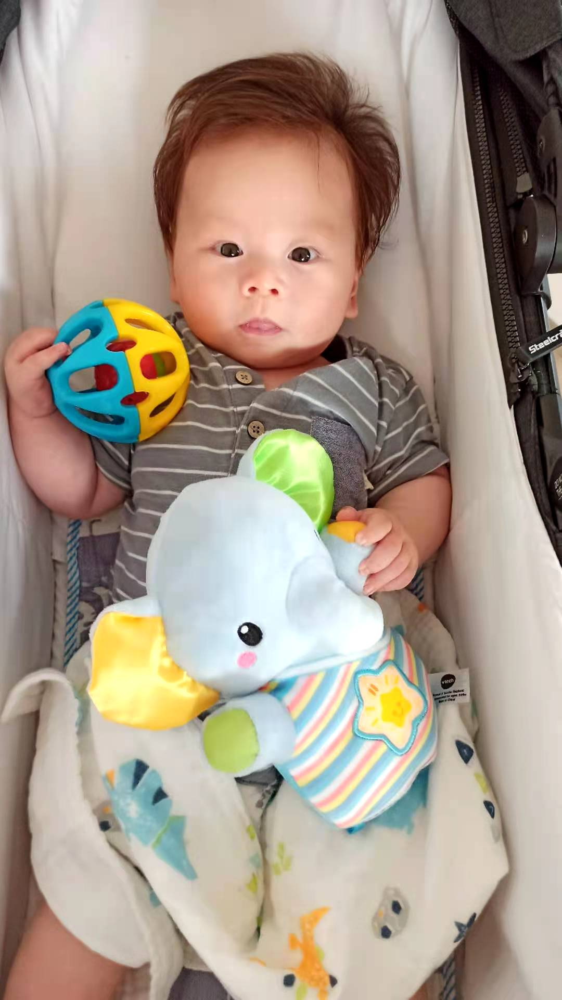
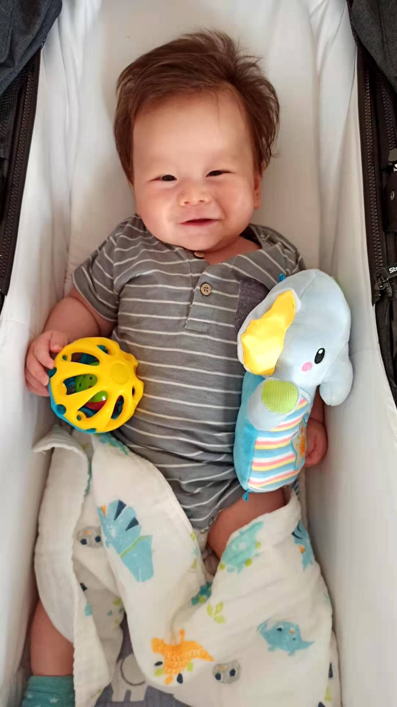
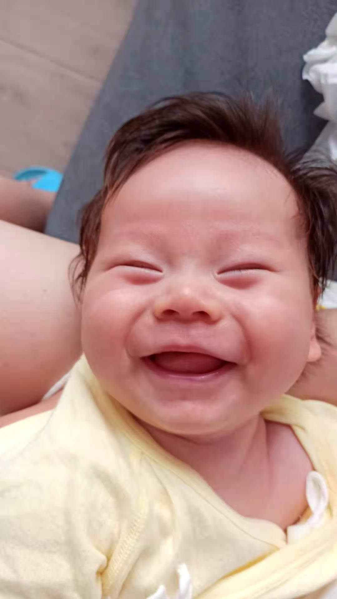
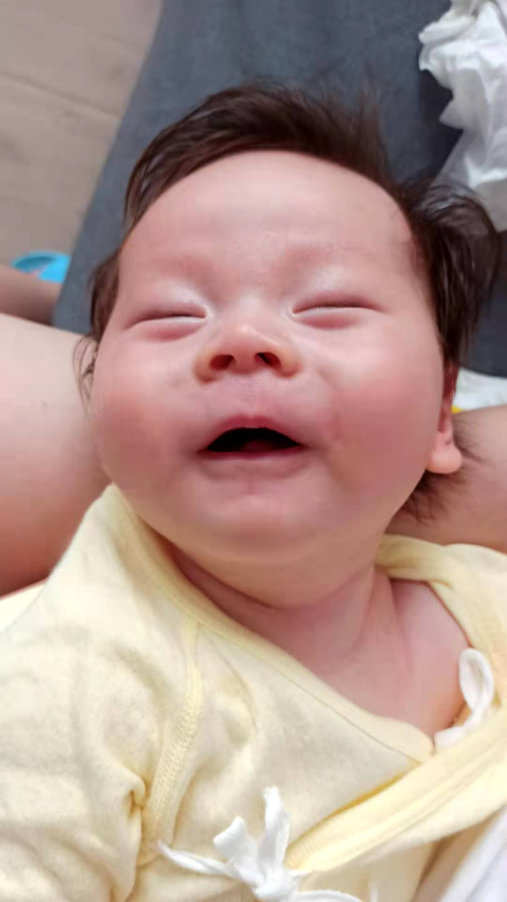

## Although it is a big day, we need to start our morning with reading 😂



## Our little start cut the cake for us 🎂





## Yimeng always likes Mama more than Papa 😹



## Wooo, look who's making a GIGI face



## The three future brother and sister hoods 😝


## See how happy he is when holding his first two gifts 🎀





## After a shower in the evening, Yimeng begins his night sleep

## He is really really happy, happy from heart, smile from face 😆





## At the end of this post, I really want to thank **Yaoyao** and **Leo**, without your help, we could never make this far. Thanks again for the nice gifts from **Alice** and **Allen**, you two are amazing kids and Yimeng's greatest elder brother and sister. Love you guys forever! 💞

### Cute Baby

---

```
{
  "firstName": "Yimeng",
  "lastName": "Jia",
  "age": "100 days",
  "weight": "8.3KG",
  "length": "67CM"
}
```
